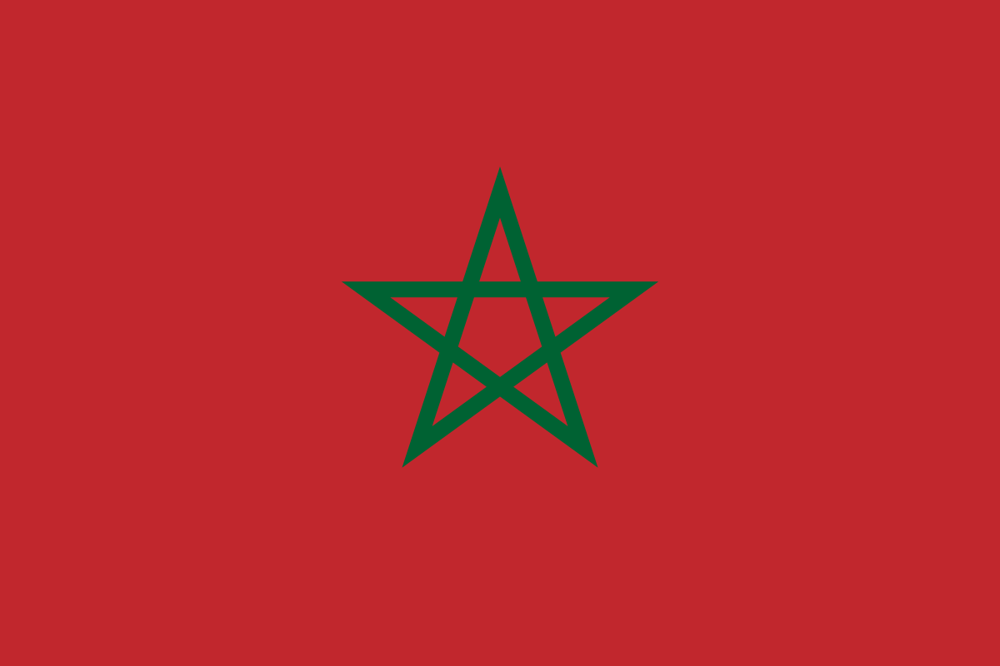

  
  <h3>Hi, my name is Mostapha Bayi 👋</h3>
  
  <h3>Who am I?</h3>
    
🎓 I'm a 19yo Computer science student.

    
💻 I'm Currently learning full stack web development.

    
✨ Aspiring software engineer and full stack web developer.

    
  <h3>Languages and Tools</h3>
  
 
    
    
    
     
     
    
     
    
    
     
    
     
    
  

  
  <h3>Let's get in touch</h3>
  

    
    
  

